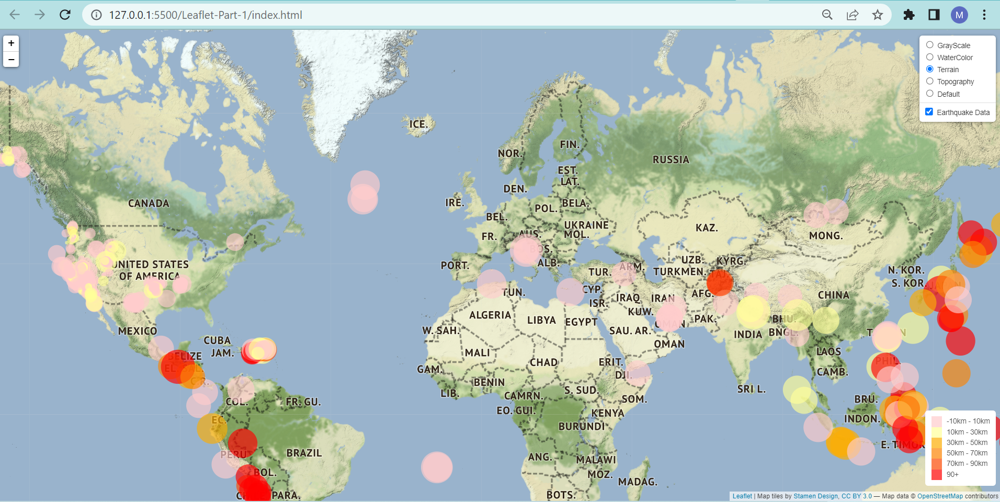
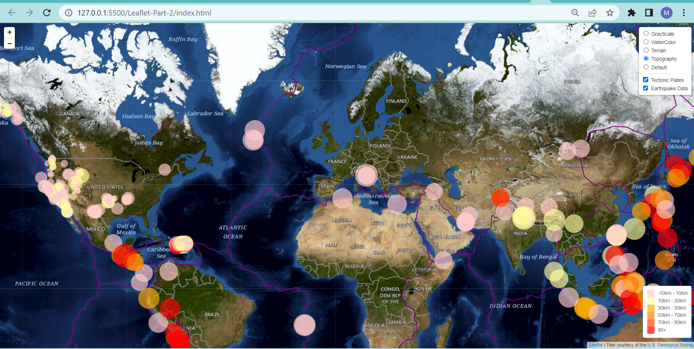

# Unit 15 Homework: Visualizing Data with Leaflet

## Background

The United States Geological Survey, or USGS for short, is responsible for providing scientific data about natural hazards, the health of our ecosystems and environment, and the impacts of climate and land-use change. Their scientists develop new methods and tools to supply timely, relevant, and useful information about the Earth and its processes. The USGS is interested in building a new set of tools that will allow them to visualize their earthquake data. They collect a massive amount of data from all over the world each day, but they lack a meaningful way of displaying it. Their hope is that being able to visualize their data will allow them to better educate the public and other government organizations (and hopefully secure more funding) on issues facing our planet. 
In this activity, we would perform 2 parts. Part 1 includes creating earthquake visualizations and part 2 includes creating the tectonic plates along with the earthquake visualizations. 

### Part 1: Create the Earthquake Visualization

Our first task is to visualize an earthquake dataset. Complete the following steps:

1. Get the dataset. To do so, follow these steps: 

   * The USGS provides earthquake data in a number of different formats, updated every five minutes. Visit the [USGS GeoJSON Feed](http://earthquake.usgs.gov/earthquakes/feed/v1.0/geojson.php) page and choose a dataset to visualize. The following image is an example screenshot of what appears when you visit this link:

   

    * We will chose the earthquakes in the past 7 days dataset. It was a JSON representation of the data. We will use the URL of this JSON to pull in the data for the visualization. The following image is a sampling of earthquake data in JSON format:

   

2. Import and visualize the data by doing the following: 

   * Using Leaflet, we will create a map that plots all the earthquakes from the dataset based on their longitude and latitude.

       *  The data markers will reflect the magnitude of the earthquake by their size and the depth of the earthquake by color. Earthquakes with higher magnitudes will appear larger, and earthquakes with greater depth will appear darker in color.

       * The depth of the earth can be found as the third coordinate for each earthquake.

   * We would include popups that provide additional information about the earthquake when its associated marker is clicked.

   * We will create a legend that will provide context for our map data.

- - -

### Part 2: Gather and Plot More Data (Optional)

The USGS wants us to plot a second dataset on our map to illustrate the relationship between tectonic plates and seismic activity. So, we will need to pull in this dataset and visualize it alongside your original data. Data on tectonic plates can be found at <https://github.com/fraxen/tectonicplates>.

The following image is an example screenshot of what the USGS would like us to produce:

we would need to perform the following tasks in order to achieve the desired goal: 

* We will need plot the tectonic plates dataset on the map in addition to the earthquakes.

* We will need add other base maps to choose from.

* We will need put each dataset into separate overlays that can be turned on and off independently.

* We will need to add layer controls to our map.

# Analysis:

After performaing all the tasks given above, we came up with the following screenshots of our index.html for part 1 and 2 :

The above picture shows the earthquakes that differ in color and size depending on their depth and magnitude.

The above Image shows the techtonic plates with the earthquake layer

This Image shows the details of the depth, magnitude and location of the earthquake once the marker is clicked.

